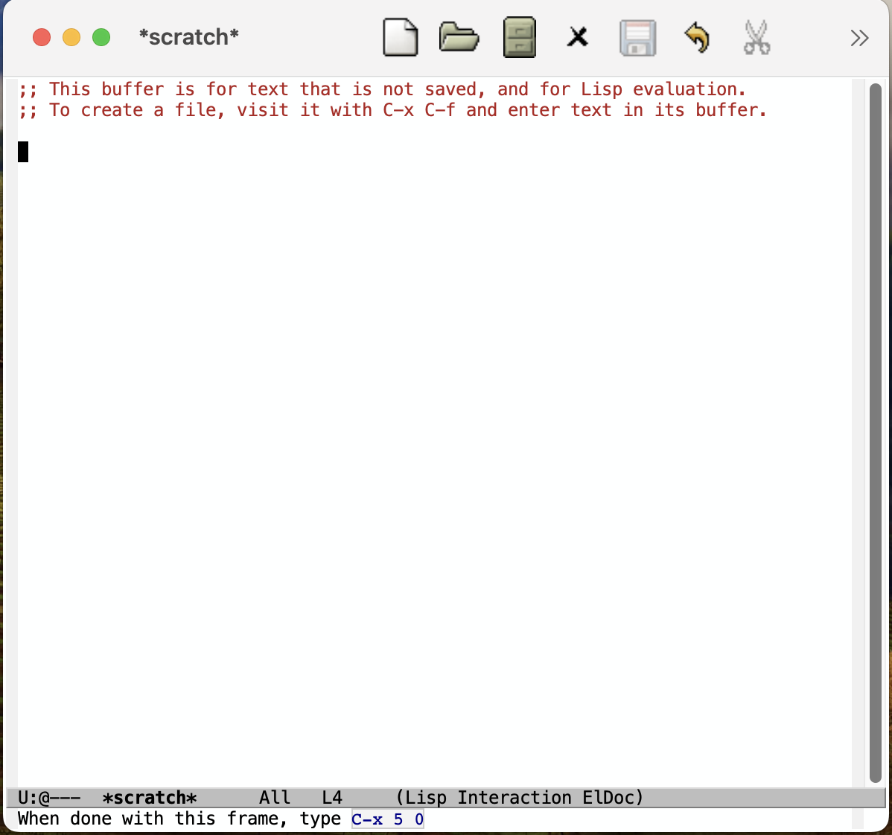

+++
title = 'Fresh Start Emacs on macOS - E01'
date = 2024-06-01T09:17:15-07:00
toc = true
tags = ['emacs']
+++

## Clean Up and Reinstall

My emacs was installed by [emacs-plus](https://github.com/d12frosted/homebrew-emacs-plus) via [brew](https://brew.sh/). It is of version 29.1 (The latest release is 29.3 at the time of writing.)

### Uninstall

There are several things to uninstall. First, the emacs binary is stored at `/opt/homebrew/bin/emacs`. To do so, we run

```sh
brew uninstall emacs-plus
```

Looking at the log, the package is actually stored at `/opt/homebrew/Cellar/emacs-plus@29/29.1`.

### Backup

Of course we have `.emacs.d` folder under `~`. What I wanna do is backup the folder to `.emacs.d.old` by

```sh
mv ~/.emacs.d ~/.emacs.d.old
```

for future reference.

### Things I didn't uninstall

There are two Automation Apps in Application folder. The `Emacs.app` is basically the code below

```sh
/opt/homebrew/opt/emacs-plus@29/bin/emacsclient 
    -c -n -q -u \
    -e "(select-frame-set-input-focus (selected-frame))" \
    -s work
```

From [emacsclient options](https://www.gnu.org/software/emacs/manual/html_node/emacs/emacsclient-Options.html), we know that

- `-c` is `--create-frame`, which creates a new graphical client frame.
- `-n` is `--no-wait`. This let `emacsclient` exit immediately.
- `-q` is `--quiet`, which does not let `emacsclient` to display messages.
- `-u` is `--suppress-output`, which dodes not let `emacsclient` display results from the server.
- `-e` is `--eval`, which runs some Emacs Lisp code. The code snippet `(select-frame-set-input-focus (selected-frame))` is for *get focus*.
- `-s server-name` is `--socket-name=server-name`

The `Capture.app` is basically

```sh
/opt/homebrew/opt/emacs-plus@29/bin/emacsclient \
  -c -n \
  -F '(quote (name . "capture"))' \
  -e "(select-frame-set-input-focus (selected-frame))" "(my/org-capture)" \
  -s work
```

Here

- `-F alist` is `--frame-parameters=alist` which sets the parameters for a newly created graphical frame.

### Reinstall

To reinstall emacs, simply

```sh
brew install emacs-plus --with-ctags --with-dbus --with-debug \
 --with-mailutils --with-no-frame-refocus --with-xwidgets \
 --with-imagemagick --with-poll --with-modern-black-variant-icon
```
The options are explained [here](https://github.com/d12frosted/homebrew-emacs-plus?tab=readme-ov-file#options-1).

- ctags: is a programming tool that generates an index file of names found in source and header files.
- dbus: is an inter-process communication mechanism for appliaitons residing on the same host. It is short for Desktop Bus.

Once the installation complete, you should see message like below:

```sh
Emacs.app was installed to:
  /opt/homebrew/opt/emacs-plus@29

To link the application to default Homebrew App location:
  osascript -e 'tell application "Finder" to make alias file to posix file "/opt/homebrew/opt/emacs-plus@29/Emacs.app" at POSIX file "/Applications" with properties {name:"Emacs.app"}'

Your PATH value was injected into Emacs.app/Contents/Info.plist

Report any issues to https://github.com/d12frosted/homebrew-emacs-plus

To start d12frosted/emacs-plus/emacs-plus@29 now and restart at login:
  brew services start d12frosted/emacs-plus/emacs-plus@29
Or, if you don't want/need a background service you can just run:
  /opt/homebrew/opt/emacs-plus@29/bin/emacs --fg-daemon
```


With `--with-native-comp` flag will result in annoying libgccgit warning and it's claimed that this is still [experimental](https://github.com/d12frosted/homebrew-emacs-plus?tab=readme-ov-file#gccemacs), hence, we didn't include this flag in installation.


## Settings

### Init File Management

The very first step I'd recommend is to use org file (`config.org`) to `init.el` file.

To do so, first create the `config.org` file at `~/.emacs.d/` folder with the following content:

```org
#+TITLE: Emacs Config
#+PROPERTY: header-args:elisp :tangle ./init.el

* Init File Management

#+begin_src elisp
(defun my/org-babel-tangle-config()
  (when (string-equal (buffer-file-name) (expand-file-name "config.org" user-emacs-directory))
    (let ((org-confirm-babel-evaluate nil)) (org-babel-tangle))))
(add-hook 'org-mode-hook (lambda () (add-hook 'after-save-hook 'my/org-babel-tangle-config)))
#+end_src
```

Remember to make sure your org file has the exact name as `config.org`. Evaluate the elisp cell by `C-c C-c` and reload org-mode by `M-x org-mode`. On saving the file, you should see the message saying

```text
Tangled 1 code block from init.org
```

and the `init.el` should be generated with the same elisp code extracted.

### Packages

[melpa](https://melpa.org/#/) has 5,750 packages for emacs at the time of writing. The default package archive contains only `gnu` and `nongnu`, which is far from enough. Another useful package is called [`use-package`](https://github.com/jwiegley/use-package), whose primary purpose is for the configuration and loading of packages. It is already included in emacs 29. To setup the melpa package archive and load use-package, add the following elisp code:

```elisp
(require 'package)
(add-to-list 'package-archives '("melpa" . "https://melpa.org/packages/") t)
(package-initialize)

;; avoid checking signature to avoid error. not a great practise.
(setq package-check-signature nil)

(require 'use-package)
(setq use-package-always-ensure t)
```

### Basic Settings

There are some easy-to-use basic settings that I like to use below:

```elisp
;; keep the .emacs.d folder clean
(setq no-littering-etc-directory (expand-file-name "~/.config/emacs/etc/"))
(setq no-littering-var-directory (expand-file-name "~/.config/emacs/var/"))

;; we need to have the variable BEFORE the setting!
(use-package no-littering)

;; enable smooth scrolling experience
(pixel-scroll-precision-mode)

;; default behavior of <home>/<end> is the head/end of document
(global-set-key (kbd "<home>") 'beginning-of-line)
(global-set-key (kbd "<end>") 'end-of-line)

;; this is mostly for Windows
(global-unset-key (kbd "C-z"))

;; delete directly
(setq delete-by-moving-to-trash t)

;; use y and n, instead of yes and no
(setopt use-short-answers t)

;; change the tab behavior
(setq tab-always-indent 'complete)

;; move the auto generated custom code to a file
(setq custom-file (locate-user-emacs-file "custom-vars.el"))
(load custom-file 'noerror 'nomessge)

;; auto-revert
(global-auto-revert-mode 1)
(setq global-auto-revert-non-file-buffers t)

;; save-place
(save-place-mode 1)
(setq save-place-forget-unreadable-files nil)

;; move backup file (afile~) autosave file (#afile#) to tmp
(setq backup-directory-alist `((".*" . ,temporary-file-directory)))
(setq auto-save-file-name-transforms `((".*" ,temporary-file-directory t)))
```

### Org (Basic)

There are a lot of settings that belongs to org-mode. To start with, we enables some essential ones in this post.

```elisp
;; I like to use shift to select
(setq org-support-shift-select t)

;; This will fix the annoying auto formatting in the elisp code of org src
(setq org-src-preserve-indentation t)

;; Add shortcut to org mode, e.g.
;; <el<TAB> will insert a elisp code block
(require 'org-tempo)
(add-to-list 'org-structure-template-alist '("el" . "src elisp"))
(add-to-list 'org-structure-template-alist '("sh" . "src shell"))
(add-to-list 'org-structure-template-alist '("py" . "src python"))
```

At the end of today, we have a rudiment version of emacs like below:



Nothing fancy but already functional.

Update 2024-06-07: I also added the following basic Org setting

```elisp
(setq org-adapt-indentation t)
(setq org-hide-leading-stars t)
(setq org-hide-emphasis-markers t)
```

to make emacs look slightly better.
