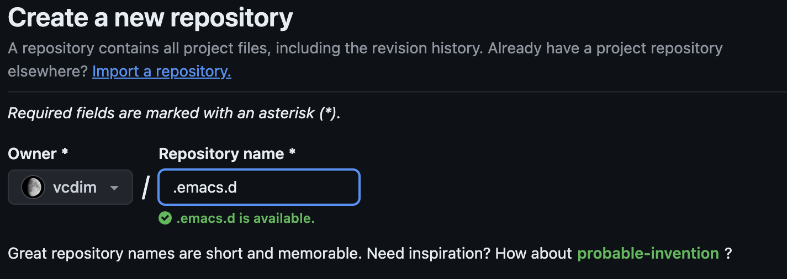
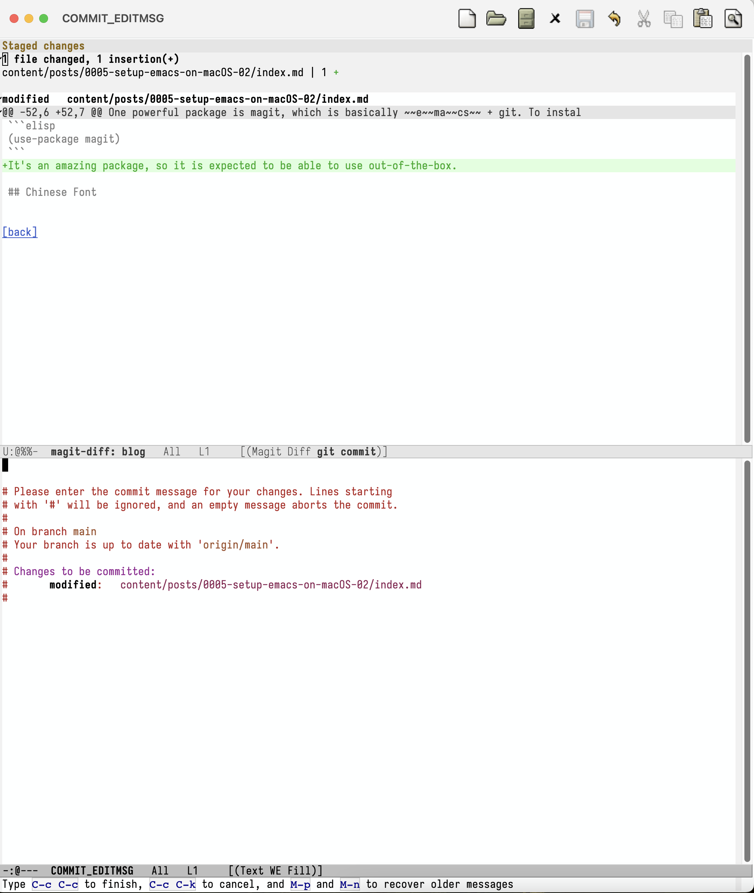
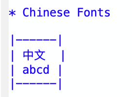
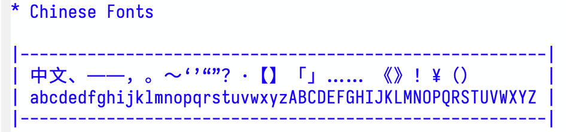

+++
title = 'Fresh Start Emacs on macOS - E02'
date = 2024-06-02T10:50:01-07:00
toc = true
tags = ['emacs']
+++

## Version Control

In order to keep track of the emacs configuration, it is usually a good idea to have a version control so that you can revert to old stable version when your emacs broke or you can jump start to have the same configuration on other (new) environment.

I use Github as my remote repository. To create a repo, **log into Github** and click on the **+** icon.

A memu will pop up and click **New repository**. In the Create a new repository page, I prefer use the name `.emacs.d` so that in the future the `git clone` command and be as simple as possible.


Also feel free to add description or README.md as you like. When you are decided, hit the **Create Repository** button.

Next step is to create a git repo in the `~/.emacs.d` folder on your local machine. To do so, you may

```sh
cd ~/.emacs.d/
git init
```

It's better to add a `.gitignore` file to avoid submitting too many temporary files. In my first commit, I have

```git
*~
elpa/archives/
```

in this file. Now you can commit the change in the local repository (by VSCode is easy, but sure you can do it using CLI). Next, I need to set the local repository pointing to the public repository just setup by

```sh
git remote add origin https://github.com/vcdim/.emacs.d.git
```

And finally push it to remote (again, by VSCode / CLI).

Now, to test our workflow, first kill emacs completely by `M-x kill-emacs` and delete the `~/.emacs.d` folder and clone the repo from Github by

```sh
rm -rf ~/.emacs.d
git clone https://github.com/vcdim/.emacs.d.git
```

If the emacs is successfully opened with the same functionality as last post, then we are good.

## magit

One powerful package is [magit](https://magit.vc/), which is basically ~~e~~ma~~cs~~ + git. To install the package, simply add the following snippet

```elisp
(use-package magit)
```

It's an amazing package, so it is expected to be able to use out-of-the-box. Below is screenshot of how magic is (ma)git:


## Chinese Font

There are so many posts for setting up Chinese fonts in emacs online:

- [Emacs 中文环境配置](https://blindwith.science/2019/07/443.html/)
- [经验分享：emacs单独设置中文与英语的字体](https://emacs-china.org/t/emacs/15676/2)
- [狠狠地折腾了一把Emacs中文字体](https://baohaojun.github.io/perfect-emacs-chinese-font.html)

just to name a few good quality ones, not to mention that many low quality ones. It's a clue that this could take some effort to get it working comfortably. Indeed, the default font is not going to work as one Chinese character is not equal to two English characters.



Here the default English font is Menlo and the default Chinese font is PingFang SC. One [simple solution](https://q3yi.me/post/5_set_different_font_family_for_sc_in_emacs/) that only takes 5 lines of code is

```elisp
(let ((default-font (font-spec :name "Iosevka" :size 15))
      (cn-font (font-spec :name "Sarasa Mono SC")))
  (set-face-attribute 'default nil :font default-font)
  (dolist (charset '(kana han symbol cjk-misc bopomofo))
    (set-fontset-font t charset cn-font)))
```

which uses **Iosevka** and **Sarasa Mono SC**. I know there are more to tweak, like getting Chinese double width (全角) punctuations rendered. But I also know that even VS code is not rendering them in a fully "elegent" way. The is the end result for this tweak:

Notice that ¥‘’“”@# are not in double width. And I know that fonts can getting boring. We can tweak this later (or never).

## Autosave and Backup Files

You will some times see emacs generate files like `#index.md#`, `.#index.md`, or `index.md~`. By default, emacs has autosave feature to prevent your work from losing. However, this is sometimes annoying. There is a treatment to declutter your working folder though dangerous (not so much actually):

```elisp
(setq backup-directory-alist `((".*" . ,temporary-file-directory)))
(setq auto-save-file-name-transforms `((".*" ,temporary-file-directory t)))
```

## Summary for today
- I am able to edit the markdown file for my hugo post.
- I am able to push commit to github within emacs.
- Chinese fonts are displayed in a pleasant way.
- I don't have syntax highlight for markdown file.