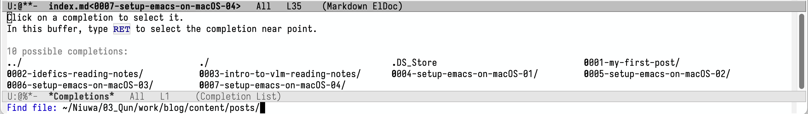
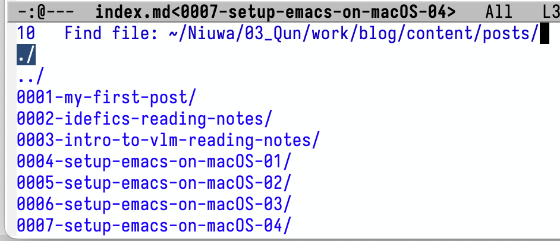
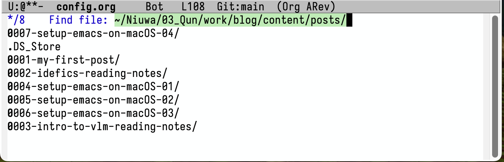
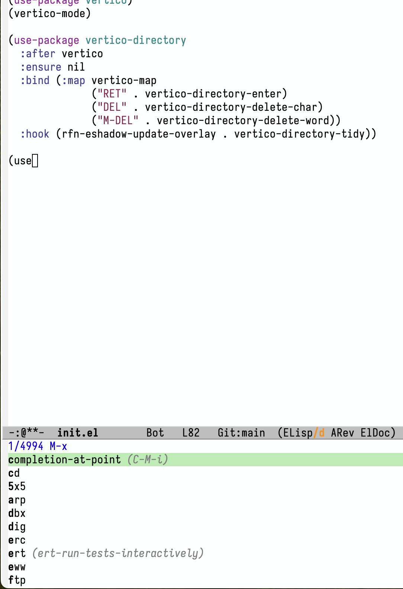
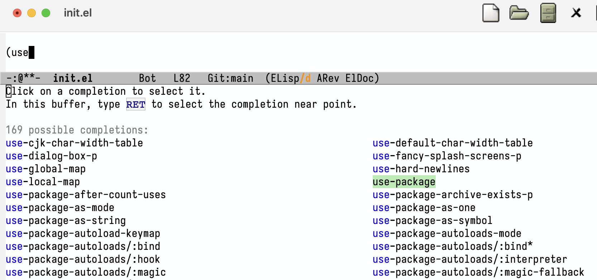
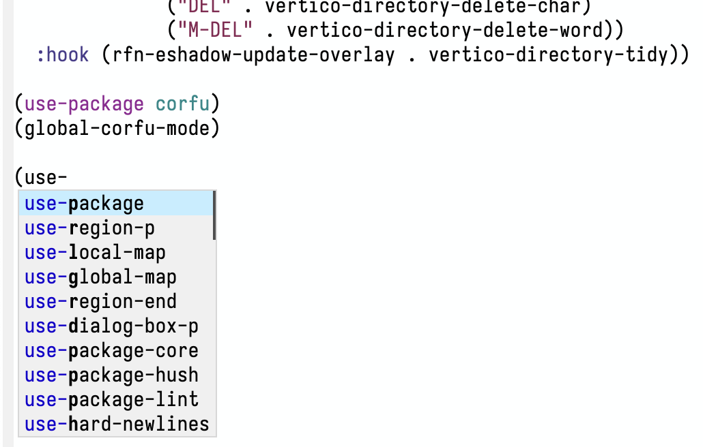
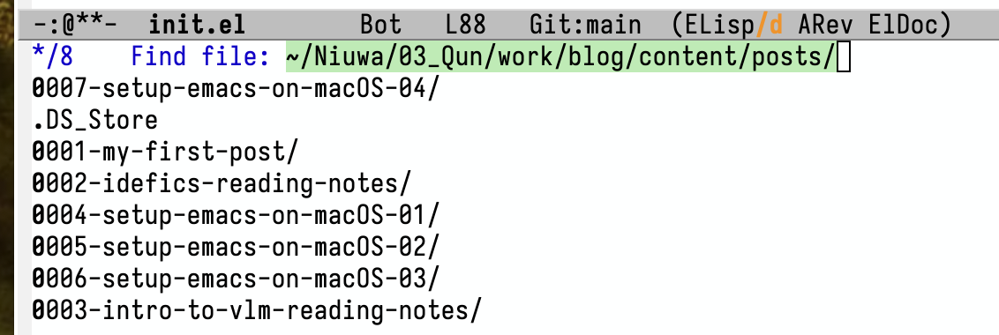
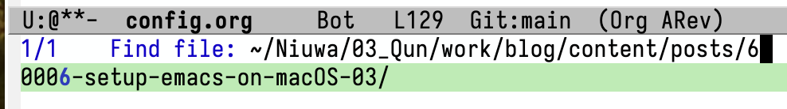
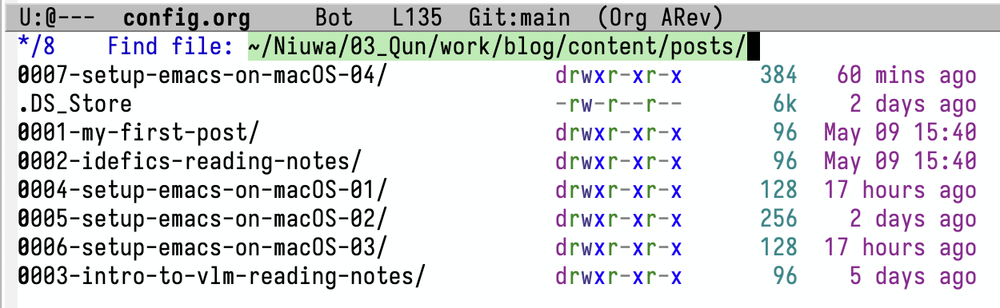
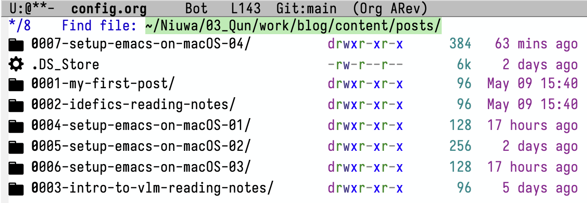

+++
title = 'Fresh Start Emacs on macOS - E04'
date = 2024-06-04T09:42:39-07:00
toc = true
tags = ['emacs']
+++

## Completion Packages

When investigate, you can find a good number of completion-related packages:

- Minibuffer
  - [swiper](https://github.com/abo-abo/swiper)
    - ivy --- a generic completion mechanism
    - counsel --- a collection of ivy-enhanced versions of common emacs command
    - swiper --- an ivy-enhanced alternative to isearch.
  - [vertico](https://github.com/minad/vertico) --- verical completion UI
- At point
  - [corfu](https://github.com/minad/corfu) --- in-buffer completion
    - [cape](https://github.com/minad/cape) --- a complete-at-point extension

There are also some old choices: like [selectrum](https://github.com/radian-software/selectrum), [icompete](https://www.emacswiki.org/emacs/IcompleteMode), [icomplete-vertical](https://github.com/oantolin/icomplete-vertical) that are not actively maintained. Another popular choice could be [helm](https://github.com/emacs-helm/helm), which is originally known as a competitor to ivy, known as full-fledge but heavier weight. I like lightweight solution.

Once you have a Completion UI (usually a minibuffer or at point), there will be other things you can do like:

- [orderless](https://github.com/oantolin/orderless) --- orderless completion style
  - [prescient](https://github.com/radian-software/prescient.el) --- simple but effective sorting and filtering

- [marginalia](https://github.com/minad/marginalia) --- add explanation to command
  - [all-the-icons-completion](https://github.com/iyefrat/all-the-icons-completion) --- add icon to minibuffer
  - [nerd-icons-completion](https://github.com/rainstormstudio/nerd-icons-completion) --- add icon to minibuffer (older)
- [embark](https://github.com/oantolin/embark) --- take action on minibuffer (Emacs Mini-Buffer-Action-Rooted in Keymaps)
- [consult](https://github.com/minad/consult) --- search and navigation commands

Some old choices are :[ido](https://www.gnu.org/software/emacs/manual/html_mono/ido.html#Activation), [icicles](https://github.com/emacsmirror/icicles).

Currently, we don't have any completion framework installed, so when I run `find-file` command, I can get completion like this.



## Ivy (DIGRESSION)

After **installing** and **enabling** the ivy package by

```elisp
(use-package ivy)
(ivy-mode 1)
```

I get the completion dialog like this:



It's slighly nicer looking. I can use keyboard to choose the item I want. Also, going back to the upper level of directory requires only one `<Backspace>`.

## Vertico

The similar vertical completion is also available in `vertico`. By installing and enabling it like below:

```elisp
(use-package vertico)
(vertico-mode)
```

and this is what I get at the same directory:



As you can see, the order has changed. It feels like the result is smarter. However, one downside is that going to upper level of directory is not as easy as ivy. There is a [patch](https://github.com/minad/vertico?tab=readme-ov-file#extensions) in the example can fix this downside.

Hence, the configuration becomes

```elisp
(use-package vertico)
(vertico-mode)

(use-package vertico-directory
  :after vertico
  :ensure nil
  :bind (:map vertico-map
              ("RET" . vertico-directory-enter)
              ("DEL" . vertico-directory-delete-char)
              ("M-DEL" . vertico-directory-delete-word))
  :hook (rfn-eshadow-update-overlay . vertico-directory-tidy))
```

There is also a very nice [demo video](https://www.reddit.com/r/emacs/comments/ryqfz1/vertico_extensions_demo/) on Reddit.

## Corfu and completion-at-point

Emacs has built-in completion mechanism. For example, when editing lisp code, you can type `use` and call `completion-at-point` like this:



A "mini"-buffer will pop out and you can choose the completion like below:


There are a couple of downsides:

1. `C-M-i` is hijacked by the Rectangle App (I'm turning these stuff off right away).
2. `<TAB>` is usually a more intuitive choice of completion at point. Inspired by the `corfu` package example, I included the

   ```elisp
   (setq tab-always-indent 'complete)
   ```

   in the basic settings.
3. It seems that I have to use mouse to make a choice, instead of keyboard and the minibuffer is not so mini, which is distracting. To make it slightly more easy to use and good looking at the same time, I installed the `corfu` package.

   ```elisp
   (use-package corfu)
   (global-corfu-mode)
   ```

   Now the completion looks much better

   

## Orderless

When I try to find a blog post in emacs, it is easier to type `6` if I go to the `0006` post.



Type a `6` will leave me with no choice. To enable such a smarter behavior, I included the orderless package as blow:

```elisp
(use-package orderless
  :custom
  (completion-styles '(orderless basic))
  (completion-category-overrides '((file (styles basic partial-completion)))))
```

The result is great:


## Marginalia

To make the minibuffer slightly good looking, I installed `marginalia` and `all-the-icon-completion` package. There might already be some assumptions as I already installed all the fonts that needed for `all-the-icon`.





## Summary

Up till this point, when I delete the `~/emacs.d/` folder and clone it from github, it takes a while to get emacs ready to be use, since downloading packages and compiling may take some time. But start the server the second time is much faster than the first run.
