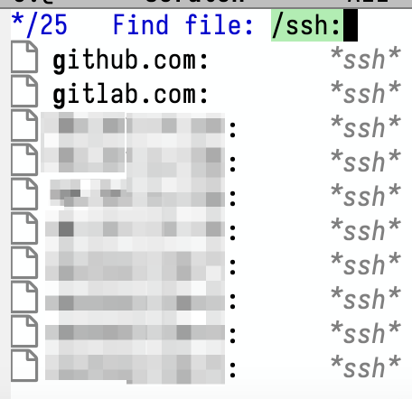

+++
title = 'Fresh Start Emacs on macOS - E05'
date = 2024-06-05T09:02:03-07:00
toc = true
tags = ['emacs']
+++

## Path

By default, emacs does not inherit the path from your terminal. This will make using LaTeX or using packages like vterm a pain, as emacs don't know where is the LaTeX commands and where is `cmake`. To overcome this, there is a package called `exec-path-from-shell` which allows one to load those environment variables. One can check environment variable by `M-x getenv`.


By default, there are only three paths.

Once installed the `exec-path-from-shell` package,

```elisp
(use-package exec-path-from-shell)
(exec-path-from-shell-initialize)
```

you will have the same `$PATH` variable as you do in the terminal.

## Terminal

Once you setup the path, it is easy to setup `vterm` 

```elisp
(use-package vterm
  :init
  (setq vterm-always-compile-module t))
```

a package that provides better shell experience than `term` and `eshell`. 


Still, vterm is not as good as iterm2 or terminal inside VS Code.

Here `(setq vterm-always-compile-module t)` is important, as if without, you need to answer `yes` to compile the vterm package. So, if you clone the configure file, the server will stuck waiting for the confirmation. This also brings the configuration with a dependency of `cmake`.

Sometimes, you will need multiple vterm open at the same time. In this case, you'll need `multi-vterm`. Simply add

```elisp
(use-package multi-vterm)
```

to your config will do the trick.

## Remote Development

Emacs has a built-in package that supports "some" remote development called [TRAMP](https://www.emacswiki.org/emacs/TrampMode). Take `ssh` as an example, invoke `find-file` by `C-x C-f` and type `/ssh:`



You'll get to choose a server/host (usually defined in `~/.ssh/config`). After choosing the server, you can start type the path to the file/directory that you plan to work on.

One thing that worth noticing is that tramp doesn't like fancy remote prompt. The sympotom will be like tramp is getting stuck or taking forever to connect to the server. There is a oneliner that helped me to [fix](https://blog.karssen.org/2016/03/02/fixing-emacs-tramp-mode-when-using-zsh/) the problem.

However, one has to admit that Tramp is not as modern as VS code. It is probably more suitable to do some quick and lightweight development or modification if you don't want to switch gear.
