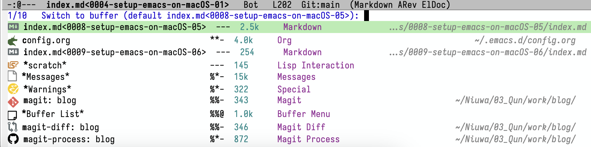
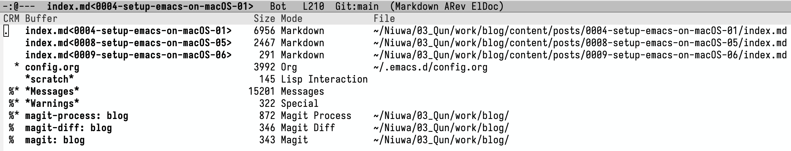
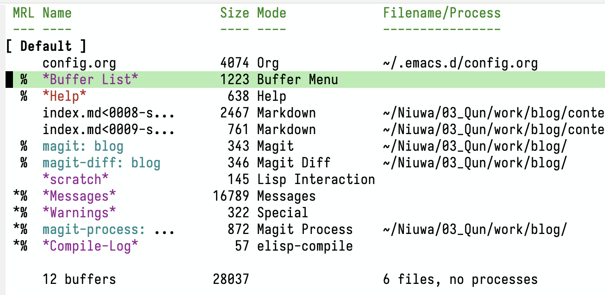
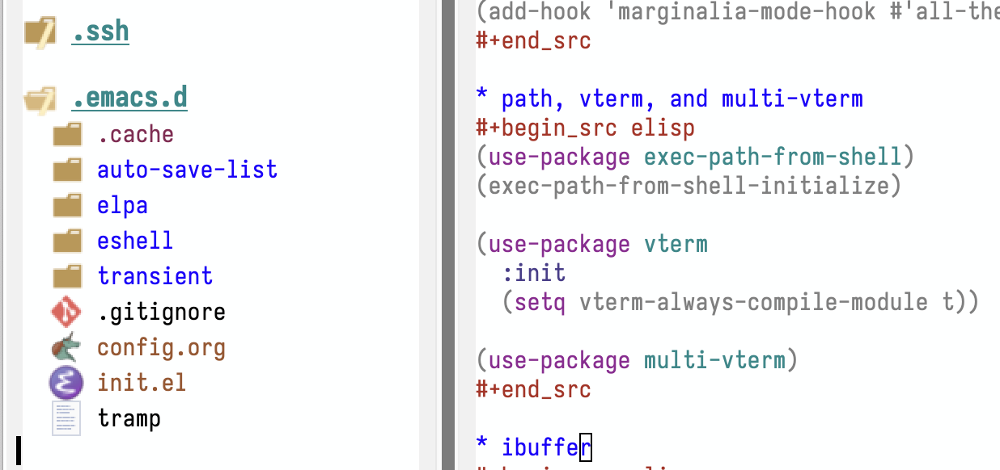
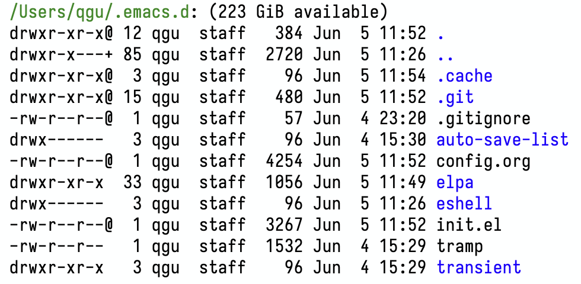
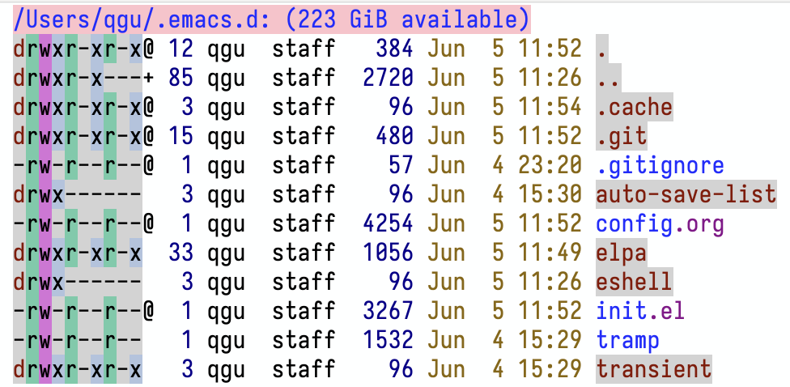

+++
title = 'Fresh Start Emacs on macOS - E06'
date = 2024-06-05T10:22:22-07:00
toc = true
tags = ['emacs']
+++

## Switch Buffer

There are several ways to switch a buffer. One is from minibuffer by `C-x b`.

The other is by call the `list-buffer` by `C-x C-b`.

The problem with the second approach is that it doesn't get an auto focus to the pop up buffer, which is annoying. Also, it's not good looking.

There is a built-in package called `ibuffer`, which is pretty good looking.

Unfortunately it doesn't have a shortcut. I found it is more intuitive to bound it to `C-x C-b`. So I am adding one line of code below

```elisp
(global-set-key (kbd "C-x C-b") 'ibuffer)
```

When deleting the buffer, there will be an annoying prompt that asking if you truely want to delete. So I also set

```elisp
(setq ibuffer-expert t)
```

## Project Management

Treemacs is a great way to quickly access the projects you are working on. It's like workspace in VSCode. Adding two lines of code will give you the functionality:

```elisp
(use-package treemacs)
(global-set-key (kbd "C-x t t") 'treemacs)
```



Again, here I bind the `C-x t t` to treemacs, as is recommended by the [package](https://github.com/Alexander-Miller/treemacs).

## Browse Files

Default file browser in emacs is `dired`, which is called **dir**ectory **ed**itor. However, it is a bit plan to look at.

There is a package can make `dired` looks better, called `diredfl`, where `fl` stands for font lock.

Installation is simple:

```elisp
(use-package diredfl)
(setq diredfl-global-mode t)
```