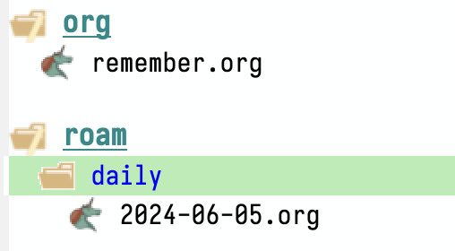
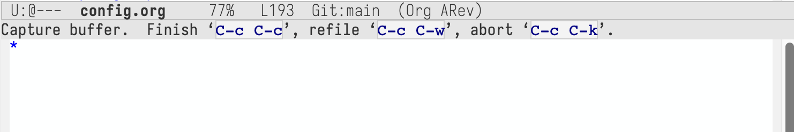
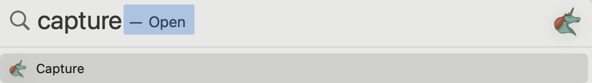
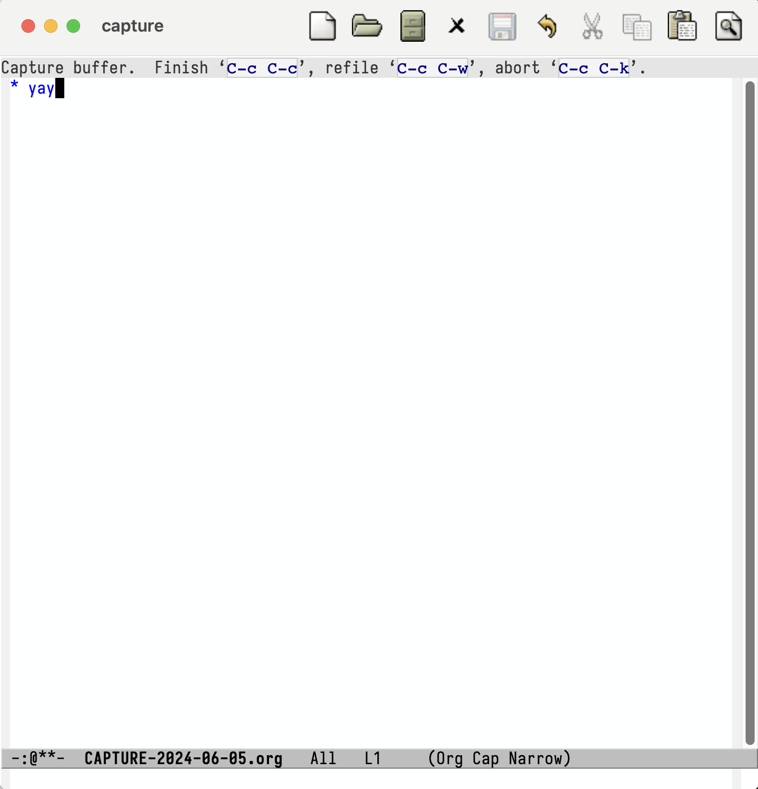

+++
title = 'Fresh Start Emacs on macOS - E07'
date = 2024-06-07T14:05:38-07:00
toc = true
tags = ['emacs']
+++

## Thoughts on Writing Notes

When I try to begin writing on `org` mode --- the "killer" app of `emacs` --- I found it's hard to find a clear motivation. Of course I know that `org` is a plain-text system (claims) that (it) can do a lot of things:

- `org-agenda` can be your calendar
- `org-capture` can be your sticky notes
- `org-roam` can be your second brain or journal
- `org-export` can be your `tex`, `md`, `html` files
- `org-babel` can be your jupyter notebook
- `org-todo` can be your to do list
- `org-present` or `org-tree-slide` can be your PPT

But the reality is,

`org-agenda` is hard to surpass Calendar or Outlook, simply because it's not good-/modern-looking enough. I also see some guys using it to recording workout, adding task like contact people, or tracking habits like brushing teeth. It just feel geeky but not smart.

Do we want to actually store (almost) all the sticky notes (or fleeting notes)? Do we want a second brain (which is actually not, and you already have one, use it well!). It's tempting that to have a so-called system to accept brain dump or knowledge base, in hoping that some diamonds are buried in some of these dumps or your knowledge base. I tried before. Pretty hard. It hadn't worked. Maybe I hadn't tried hard enough? But I can see the bright sides is: through brain dump, you can look busy, have something to show to people, and relief stress during writing.

`org` is a pretty good place to store password though. Of course, under the assumption that encryption is strong enough. It works for me, as passwords are mostly likely representable by text. It's better than excel, word, or apple notes.

Notes are personal, helping myself to remember things. I don't need to present them all to the public.

So, I will start experiment this time with a different mindset: **I want the notes to be of more effective** in balancing the effort and quality.

I want to have the connected notes functionality. Majorly for scientific literature review. I also want to have a more traditional tree-structured folder to store some standalone notes.

## org-roam

To install the package with basic functionality to operate on nodes, we use the following code

```elisp
(use-package org-roam
  :bind
  (("C-c n l" . org-roam-buffer-toggle)
   ("C-c n f" . org-roam-node-find)
   ("C-c n i" . org-roam-node-insert)
   ("C-c n c" . org-roam-capture)
   ("C-c n j" . org-roam-dailies-capture-today)
   ("C-c n d" . org-roam-dailies-goto-today)
   )
  )
(setq org-roam-directory "~/Niuwa/03_Qun/roam/")

;; relative path to org-roam-directory
(setq org-roam-dailies-directory "daily/")

(setq org-roam-dailies-capture-templates
      '(("d" "default" entry "* %?"
         :target (file+head "%<%Y-%m-%d>.org" "#+title: %<%Y-%m-%d>\n"))))
```

Here, `org-roam-buffer` is the buffer with backlinks. The `org-roam-directory` feels a bit exposed. I would like to have a better way in the future. The folder structure now looks like this



where the `daily/` folder is the so-called fleeting notes. The important notes will be saved in `org/` folder. The research article notes will be saved directly in the `roam/` folder.

When I call `org-roam-dailies-capture-today`, there will be a prompt looks like this:



Basically, I am editing one of the headline for today's org-note (`2024-06-05.md`). When I completed editing, the file will also be updated.

### Global org-roam Capture

I had been tweaking for the **"global-capture"** in macOS. It is basically has two steps: (1) create an Automation App that contains the following code

```sh
/opt/homebrew/opt/emacs-plus@29/bin/emacsclient \
  -n -c \
  -F '(quote (name . "capture"))' \
  -e "(select-frame-set-input-focus (selected-frame))" \
     "(my/org-capture)" \
  -s work
```

and (2) add the following code in the config.

```elisp
(defun my/org-capture ()
  (interactive)
  (delete-other-windows)
  (cl-letf (((symbol-function 'switch-to-buffer-other-window) #'switch-to-buffer))
    (condition-case err (org-roam-dailies-capture-today)
      (error (when (equal err '(error "Abort")) (delete-frame))))))

(defadvice org-capture-finalize (after delete-capture-frame activate)
  (if (equal "capture" (frame-parameter nil 'name))
      (delete-frame)))
```

So when I run Capture.App from Spotlight (or Alfred) like this,



There will pop out a emacsclient which is actually have the same functionality as the capture buffer we see before



Again, I tested to delete the entire `.emacs.d` folder and clone again. It takes even longer to get ready (as expected). But again it is working properly. Current location of `org-roam.db` also reside in `.emacs.d`. Deleting the `.emacs.d` folder can also delete the database. Use `M-x org-roam-db-sync` can rebuild the database file nice and ease.

If other people want to use this config, there are something that definitely should tweak:

- The `org-roam-directory` is unlikely to be the same as mine.
- I also pushed the `.cache/treemacs-persist` file to the repo. This is saving my time not adding projects again and again to treemacs. But other people will have different structure. So feel free to remove the `.cache` folder.
