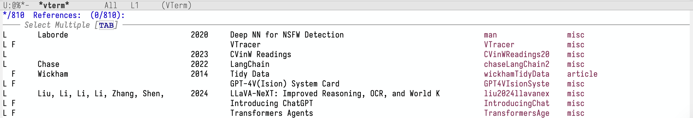
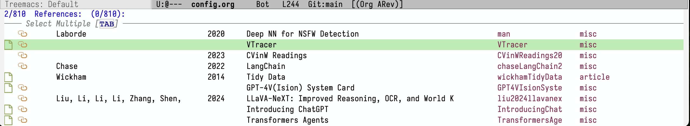
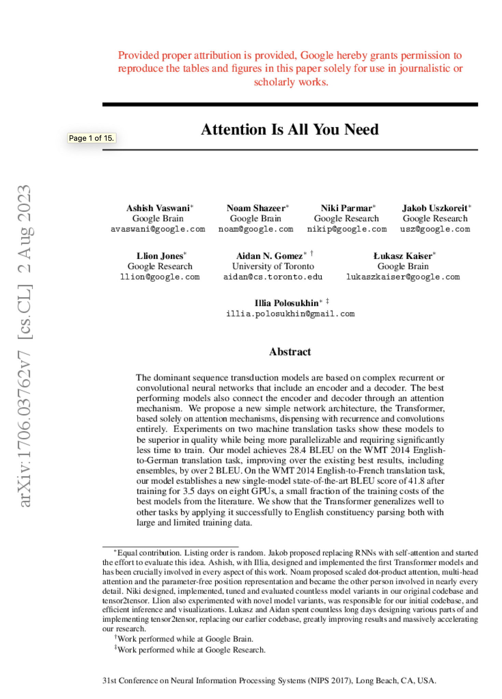
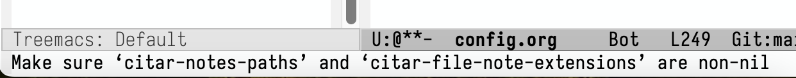
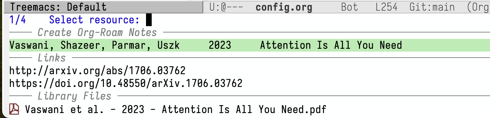
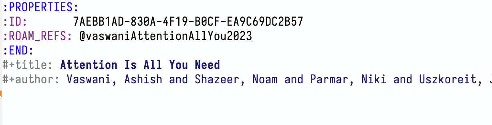
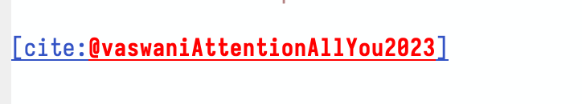
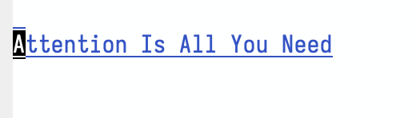

+++
title = 'Fresh Start Emacs on macOS - E08'
date = 2024-06-08T10:01:26-07:00
toc = true
tag = ['emacs']
+++

## citar

Citar is a frontend for browse and act on your bib. library. To install it with some minimal setting,

```elisp
(use-package citar
  :custom
  (citar-bibliography '("~/Niuwa/03_Qun/common/gq.bib"))
  (org-cite-insert-processor 'citar)
  (org-cite-follow-processor 'citar)
  :hook
  (LaTeX-mode . citar-capf-setup)
  (org-mode . citar-capf-setup)
  (markdown-mode . citar-capf-setup)
  )
```

you will get a pretty decent looking UI after calling `citar-open`.



One can insert a citation inside org, markdown, or LaTeX file in various form by `citar-insert-*`, for example, `keys`, formatted `citation`, or even bibtex chunk.

To have make it slightly better looking, with the following setting

```elisp
(defvar citar-indicator-files-icons (citar-indicator-create
   :symbol (all-the-icons-faicon "file-o" :face 'all-the-icons-green :v-adjust -0.1)
   :function #'citar-has-files :padding "  " :tag "has:files"))
(defvar citar-indicator-links-icons (citar-indicator-create
   :symbol (all-the-icons-octicon "link" :face 'all-the-icons-orange :v-adjust 0.01)
   :function #'citar-has-links :padding "  " :tag "has:links"))
(defvar citar-indicator-notes-icons (citar-indicator-create
   :symbol (all-the-icons-material "speaker_notes" :face 'all-the-icons-blue :v-adjust -0.3)
   :function #'citar-has-notes :padding "  " :tag "has:notes"))
(defvar citar-indicator-cited-icons (citar-indicator-create
   :symbol (all-the-icons-faicon "circle-o" :face 'all-the-icon-green)
   :function #'citar-is-cited :padding "  " :tag "is:cited"))
(setq citar-indicators
      (list citar-indicator-files-icons citar-indicator-links-icons
            citar-indicator-notes-icons citar-indicator-cited-icons))
```

we have


One thing you will notice when opening PDF inside citar is that... it's very slow and vague.



We want to change to external viewers to view PDF. To do so, oneliner can be

```elisp
(add-to-list 'citar-file-open-functions '("pdf" . citar-file-open-external))
```

## Take Notes for a Paper (citar-org-roam)

When you run `citar-open-notes` under current setting, you will face an error:



To avoid this, we can use

```elisp
(use-package citar-org-roam
  :after (citar org-roam)
  :config (citar-org-roam-mode))
```

The default title format is `{author} :: {title}`. I like to change it to `{title} :: {author}`

```elisp
(setq citar-org-roam-note-title-template "${title}\n#+author: ${author}\n")
```

With the configuration above, I am able to create org-roam notes



in the roam directory. 



## Insert Citation / Link to Node

To insert citation, call `org-cite-insert` or `citar-insert-edit` under org mode. You will get a citation link like this.



Pressing `C-c C-o` will open the citar buffer where you can choose to open PDF or notes.

If I want to link a note, I can call `org-roam-node-insert` or `C-c n i`.



Pressing `C-c C-o` will open the notes directly.