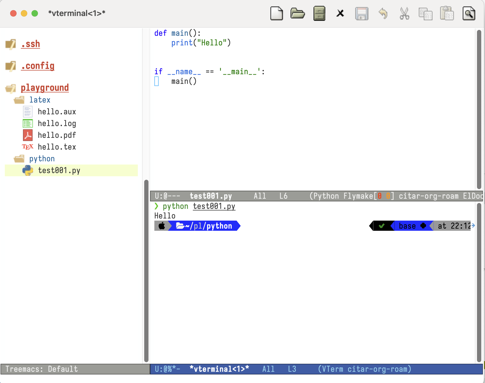
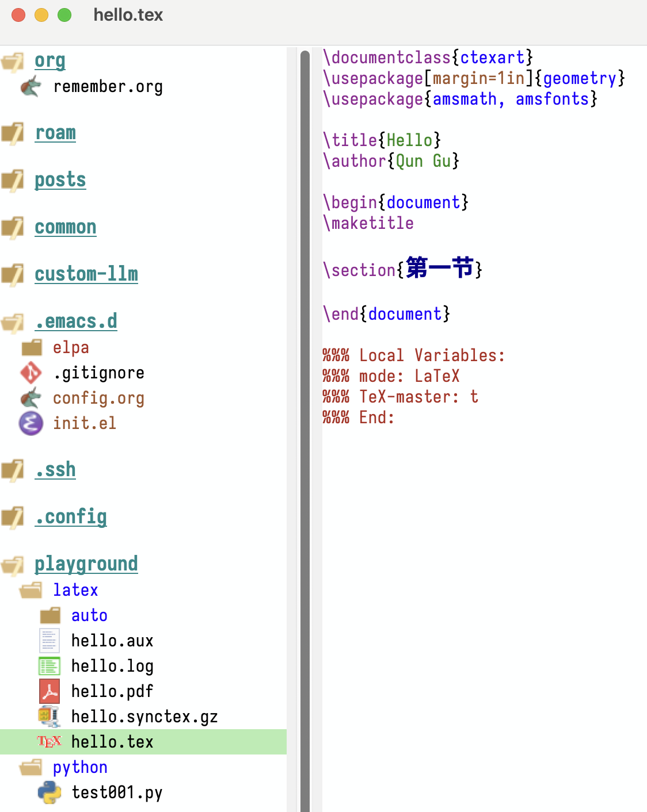
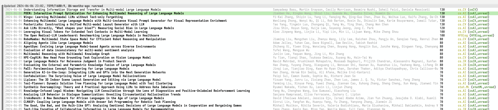

+++
title = 'Fresh Start Emacs on macOS - E09'
date = 2024-06-09T21:24:18-07:00
toc = true
tags = ['emacs']
+++

## IDE for Python (`eglot`)

Eglot seems to be an awesome package for plain text programming. And eglot is already integrated with emacs 29. To enable it, you just need to run `M-x eglot` and you can have the programming language server setup.



## Smart Parentheisis (`smartparens`)

There is an amazing [package](https://github.com/Fuco1/smartparens) and an amazing [blog](https://ebzzry.com/en/emacs-pairs/) that dealt with the parenthesis. The following

```elisp
(use-package smartparens-mode
  :ensure smartparens
  :config
  (require 'smartparens-config))
(smartparens-global-mode)
(bind-keys
 :map smartparens-mode-map
 ("C-M-a" . sp-beginning-of-sexp)
 ("C-M-e" . sp-end-of-sexp)
 ("C-<down>" . sp-down-sexp)
 ("C-<up>"   . sp-up-sexp)
 ("M-<down>" . sp-backward-down-sexp)
 ("M-<up>"   . sp-backward-up-sexp)
 ("C-M-f" . sp-forward-sexp)
 ("C-M-b" . sp-backward-sexp)
 ("C-M-n" . sp-next-sexp)
 ("C-M-p" . sp-previous-sexp)
 ("C-S-f" . sp-forward-symbol)
 ("C-S-b" . sp-backward-symbol)
 ("C-<right>" . sp-forward-slurp-sexp)
 ("M-<right>" . sp-forward-barf-sexp)
 ("C-<left>"  . sp-backward-slurp-sexp)
 ("M-<left>"  . sp-backward-barf-sexp)
 ("C-M-t" . sp-transpose-sexp)
 ("C-M-k" . sp-kill-sexp)
 ("C-k"   . sp-kill-hybrid-sexp)
 ("M-k"   . sp-backward-kill-sexp)
 ("C-M-w" . sp-copy-sexp)
 ("C-M-d" . delete-sexp)
 ("M-<backspace>" . backward-kill-word)
 ("C-<backspace>" . sp-backward-kill-word)
 ([remap sp-backward-kill-word] . backward-kill-word)
 ("M-[" . sp-backward-unwrap-sexp)
 ("M-]" . sp-unwrap-sexp)
 ("C-x C-t" . sp-transpose-hybrid-sexp)
 ("C-c ("  . sp-wrap-round)
 ("C-c ["  . sp-wrap-square)
 ("C-c {"  . sp-wrap-curly))
```

## IDE for LaTeX (`auctex`, `cdlatex`)

The classical package for editing LaTeX is `auctex`. My legacy configuration is like below

```elisp
(use-package tex
  :ensure auctex)
(setq-default TeX-master nil)
(setq TeX-parse-self t)
(setq TeX-engine 'xetex)
(setq TeX-command-extra-options "-shell-escape")
(setq TeX-electric-sub-and-superscript t)
(setq TeX-auto-save t)
(setq TeX-command-default "XeLaTeX")
(setq TeX-save-query nil)
(setq TeX-show-compilation nil)
(setq TeX-source-correlate-start-server t)
(add-to-list 'LaTeX-verbatim-environments "minted")
(add-to-list 'TeX-command-list
             '("XeLaTeX" "%`xelatex%(mode)%' -shell-escape -synctex=1 %t" TeX-run-TeX nil t))
;; come back to tex file after compilation finishes
(add-hook 'TeX-after-compilation-finished-functions #'TeX-revert-document-buffer)
```



To enable faster typing command, an excellent package is called [`cdlatex`](https://github.com/cdominik/cdlatex/tree/master) with the following setup
```elisp
(use-package cdlatex)
(add-hook 'LaTeX-mode-hook #'turn-on-cdlatex)
```

## RSS Reader (`elfeed`)

Emacs famous RSS reader is `elfeed`, below is my legacy configuration.

```elisp
(use-package elfeed)
(setq elfeed-search-title-max-width 150)
(defun concatenate-authors (authors-list)
  (mapconcat (lambda (author) (plist-get author :name)) authors-list ", "))
(defun my-search-print-fn (entry)
  (let* ((date (elfeed-search-format-date (elfeed-entry-date entry)))
         (title (or (elfeed-meta entry :title) (elfeed-entry-title entry) ""))
         (title-faces (elfeed-search--faces (elfeed-entry-tags entry)))
         (feed (elfeed-entry-feed entry))
         (feed-title (when feed (or (elfeed-meta feed :title) (elfeed-feed-title feed))))
         (entry-authors (concatenate-authors (elfeed-meta entry :authors)))
         (tags (mapcar #'symbol-name (elfeed-entry-tags entry)))
         (tags-str (mapconcat (lambda (s) (propertize s 'face 'elfeed-search-tag-face)) tags ","))
         (title-width (- (window-width) 10 elfeed-search-trailing-width))
         (title-column (elfeed-format-column
                        title (elfeed-clamp elfeed-search-title-min-width
					    title-width elfeed-search-title-max-width)
                        :left))
         (entry-score (elfeed-format-column
                       (number-to-string
                        (elfeed-score-scoring-get-score-from-entry entry))
                       10 :left))
         (authors-width 135)
         (authors-column (elfeed-format-column
                          entry-authors
                          (elfeed-clamp elfeed-search-title-min-width authors-width 10
					:left)))
	 (insert (propertize date 'face 'elfeed-search-date-face) " ")
	 (insert (propertize title-column 'face title-faces 'kbd-help title) " ")
	 (insert (propertize authors-column 'face 'elfeed-search-date-face 'kbd-help entry-authors) " ")
	 (insert entry-score " ")
	 (when entry-authors (insert (propertize feed-title 'face 'elfeed-search-feed-face) " "))
	 (when tags (insert "(" tags-str ")"))
	 )
    )
  )
(setq elfeed-search-print-entry-function #'my-search-print-fn)
(run-at-time nil (* 8 60 60) #'elfeed-update)
(use-package elfeed-org
  :config
  (setq rmh-elfeed-org-files (list (concat no-littering-var-directory "elfeed.org")))
  (elfeed-org)
  )
(use-package elfeed-score
  :after elfeed
  :config
  (elfeed-score-load-score-file (concat no-littering-var-directory "elfeed.score"))
  (elfeed-score-enable)
  (define-key elfeed-search-mode-map "=" elfeed-score-map))

```


