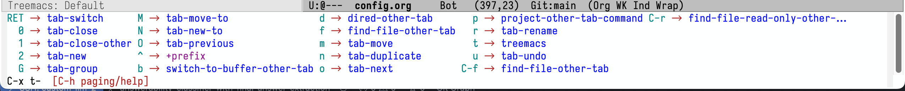

+++
title = 'Fresh Start Emacs on macOS - E10'
date = 2024-06-10T21:34:06-07:00
toc = true
tags = ['emacs']
+++

## More Hints

There is an amazing package called which-key, which is very helpful in prompt with available shortcuts. To install and enable it, simply by

```elisp
(use-package which-key)
(which-key-mode)
```



## More Org Settings

Some other tweaks that I find easier to use:

```elisp
;; org-refile
(setq org-refile-targets '((org-agenda-files :maxlevel . 3)))
(setq org-refile-use-outline-path 'file) 
(setq org-outline-path-complete-in-steps nil)
(setq org-tags-column -100)
```

## More Basic Settings

```elisp
;; enable truncate lines and visual-line-mode (word-wrap) by default
(set-default 'truncate-lines t)
(global-set-key (kbd "C-z") 'toggle-truncate-lines)
(global-visual-line-mode t)
```